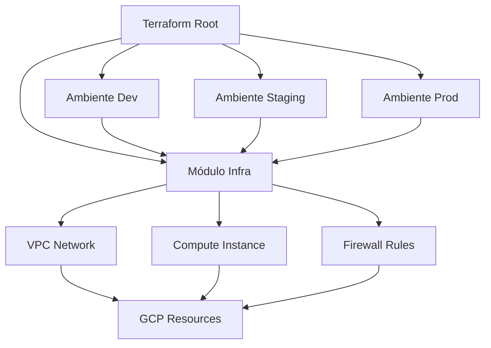

# 🚀 GCP Infrastructure with Terraform

> **Demonstração de conhecimento em Infrastructure as Code (IaC) utilizando Terraform para provisionamento de ambientes na Google Cloud Platform**

[](https://www.terraform.io/)
[](https://cloud.google.com/)
[](https://opensource.org/licenses/MIT)

## 📋 Índice

- [Sobre o Projeto](#sobre-o-projeto)
- [Arquitetura](#arquitetura)
- [Tecnologias Utilizadas](#tecnologias-utilizadas)
- [Estrutura do Projeto](#estrutura-do-projeto)
- [Pré-requisitos](#pré-requisitos)
- [Configuração Inicial](#configuração-inicial)
- [Como Usar](#como-usar)
- [Ambientes](#ambientes)
- [Recursos Provisionados](#recursos-provisionados)
- [Boas Práticas Implementadas](#boas-práticas-implementadas)
- [Comandos Úteis](#comandos-úteis)
- [Troubleshooting](#troubleshooting)
- [Roadmap](#roadmap)
- [Contribuição](#contribuição)
- [Licença](#licença)

## 🎯 Sobre o Projeto

Este projeto demonstra a aplicação de conceitos avançados de **Infrastructure as Code (IaC)** utilizando **Terraform** para provisionar e gerenciar infraestrutura na **Google Cloud Platform (GCP)**. O projeto foi desenvolvido seguindo as melhores práticas da indústria, incluindo:

- **Modularização** da infraestrutura
- **Separação de ambientes** (dev, staging, prod)
- **Versionamento** de providers
- **Variabilização** de recursos
- **Outputs** estruturados
- **Documentação** completa

### 🎯 Objetivos de Aprendizado

- ✅ Demonstrar proficiência em Terraform
- ✅ Implementar boas práticas de IaC
- ✅ Gerenciar múltiplos ambientes
- ✅ Provisionar recursos GCP
- ✅ Aplicar conceitos de DevOps
- ✅ Preparar base para integração com Ansible

## 🏗️ Arquitetura



## 🛠️ Tecnologias Utilizadas

| Tecnologia | Versão | Descrição |
|------------|--------|-----------|
| **Terraform** | ~> 1.0 | Infrastructure as Code |
| **Google Cloud Provider** | 6.8.0 | Provider para GCP |
| **Google Cloud Platform** | - | Plataforma de nuvem |
| **Ubuntu** | 22.04 LTS | Sistema operacional das VMs |

## 📁 Estrutura do Projeto

```
GCP_Terraform/
├── 📄 README.md                 # Documentação do projeto
├── 📄 LICENSE                   # Licença MIT
├── 📄 .gitignore               # Arquivos ignorados pelo Git
├── 📁 infra/                   # Módulo principal da infraestrutura
│   ├── 📄 main.tf              # Recursos principais
│   ├── 📄 variables.tf         # Variáveis do módulo
│   └── 📄 outputs.tf           # Outputs do módulo
└── 📁 env/                     # Configurações por ambiente
    ├── 📁 dev/                 # Ambiente de desenvolvimento
    │   ├── 📄 main.tf          # Configuração do ambiente dev
    │   ├── 📄 terraform.tfvars # Valores das variáveis
    │   └── 📄 outputs.tf       # Outputs específicos
    ├── 📁 staging/             # Ambiente de staging
    └── 📁 prod/                # Ambiente de produção
```

### 🔍 Detalhamento dos Diretórios

- **`infra/`**: Contém o módulo reutilizável com a definição da infraestrutura
- **`env/`**: Separação por ambientes, cada um com suas configurações específicas
- **`env/dev/`**: Ambiente de desenvolvimento com recursos mínimos

## ⚡ Pré-requisitos

Antes de executar este projeto, certifique-se de ter:

### 🔧 Ferramentas Necessárias

- [Terraform](https://www.terraform.io/downloads) >= 1.0
- [Google Cloud SDK](https://cloud.google.com/sdk/docs/install) >= 400.0.0
- [Git](https://git-scm.com/downloads)

### ☁️ Configurações GCP

1. **Conta Google Cloud** ativa
2. **Projeto GCP** criado
3. **APIs habilitadas**:
   - Compute Engine API
   - Cloud Resource Manager API
4. **Credenciais configuradas**

## 🚀 Configuração Inicial

### 1. Clone o Repositório

```bash
git clone https://github.com/Th4uan/road-for-terraform.git
cd road-for-terraform
```

### 2. Configurar Credenciais GCP

```bash
# Autenticar com o Google Cloud
gcloud auth login

# Configurar projeto padrão
gcloud config set project SEU_PROJECT_ID

# Configurar credenciais para o Terraform
gcloud auth application-default login
```

### 3. Configurar Variáveis

Edite o arquivo `env/dev/main.tf` e ajuste as variáveis:

```hcl
module "dev" {
  source = "../../infra"

  gcp_project_id = "seu-project-id-aqui"
  region         = "us-central1"
  zone           = "us-central1-a"
  instance_name  = "dev-vm-instance"
  instance_type  = "f1-micro"
}
```

## 🎮 Como Usar

### Deployment do Ambiente de Desenvolvimento

```bash
# Navegar para o ambiente dev
cd env/dev

# Inicializar o Terraform
terraform init

# Planejar as mudanças
terraform plan

# Aplicar a infraestrutura
terraform apply
```

### Verificar Recursos Criados

```bash
# Listar outputs
terraform output

# Verificar estado
terraform show
```

### Destruir Infraestrutura

```bash
# Destruir recursos (cuidado!)
terraform destroy
```

## 🌍 Ambientes

| Ambiente | Descrição | Recursos | Status |
|----------|-----------|----------|--------|
| **Dev** | Desenvolvimento | 1x f1-micro VM | ✅ Implementado |
| **Staging** | Teste/Homologação | 1x e2-medium VM | 🚧 Planejado |
| **Prod** | Produção | 2x e2-standard-2 VM | 🚧 Planejado |

### 📋 Configurações por Ambiente

#### Development
- **Instância**: f1-micro (1 vCPU, 0.6GB RAM)
- **Disco**: 10GB SSD
- **Rede**: VPC padrão
- **Custo**: ~$5-10/mês

#### Staging (Planejado)
- **Instância**: e2-medium (1 vCPU, 4GB RAM)
- **Disco**: 20GB SSD
- **Rede**: VPC dedicada
- **Load Balancer**: Sim

#### Production (Planejado)
- **Instâncias**: 2x e2-standard-2 (2 vCPU, 8GB RAM)
- **Disco**: 50GB SSD
- **Rede**: VPC privada
- **Load Balancer**: Sim
- **Auto Scaling**: Sim

## 📦 Recursos Provisionados

### 🖥️ Compute Instance
- **Tipo**: Configurável por variável
- **Imagem**: Ubuntu 22.04 LTS
- **Disco**: Boot disk com SSD
- **Rede**: Interface pública

### 🌐 Networking
- **VPC**: Rede virtual privada personalizada
- **Subnet**: Sub-rede regional
- **Firewall**: Regras de segurança (planejado)
- **IP Público**: Configuração automática

### 🔧 Configurações
- **Tags**: Organizacionais e de ambiente
- **Metadata**: SSH keys e startup scripts (planejado)
- **Monitoring**: Integração com Cloud Monitoring (planejado)

## ✨ Boas Práticas Implementadas

### 🏗️ Estrutura e Organização

- ✅ **Modularização**: Código reutilizável e organizizado
- ✅ **Separação de ambientes**: Configurações isoladas
- ✅ **Versionamento de providers**: Controle de versões
- ✅ **Nomenclatura consistente**: Padrões de naming

### 🔒 Segurança

- ✅ **Variáveis sensíveis**: Não commitadas no código
- ✅ **Princípio do menor privilégio**: Recursos mínimos necessários
- ✅ **Estado remoto**: Preparado para backend remoto
- ✅ **Validações**: Tipos de variáveis definidos

### 📊 Monitoramento e Observabilidade

- ✅ **Outputs estruturados**: Informações importantes expostas
- ✅ **Tags consistentes**: Para rastreamento e billing
- ✅ **Documentação inline**: Descrições claras
- ✅ **Logging preparado**: Base para implementação

### 🔄 DevOps e Automação

- ✅ **Git workflow**: Controle de versão adequado
- ✅ **Estrutura para CI/CD**: Preparada para automação
- ✅ **Terraform formatting**: Código formatado e validado
- ✅ **Reutilização**: Módulos compartilháveis

## 🛠️ Comandos Úteis

### Terraform Essenciais

```bash
# Formatação do código
terraform fmt -recursive

# Validação da sintaxe
terraform validate

# Plano com saída detalhada
terraform plan -out=tfplan

# Aplicar plano específico
terraform apply tfplan

# Importar recurso existente
terraform import google_compute_instance.vm_instance projects/PROJECT_ID/zones/ZONE/instances/INSTANCE_NAME

# Mostrar estado atual
terraform show

# Listar recursos
terraform state list

# Refresh do estado
terraform refresh
```

### GCP CLI Úteis

```bash
# Listar projetos
gcloud projects list

# Verificar APIs habilitadas
gcloud services list --enabled

# Listar instâncias
gcloud compute instances list

# Listar redes
gcloud compute networks list

# Verificar quotas
gcloud compute project-info describe --format="table(quotas[].metric:sort=1:label=METRIC,quotas[].limit:label=LIMIT,quotas[].usage:label=USAGE)"
```

## 🚨 Troubleshooting

### Problemas Comuns

#### 🔴 Erro de Autenticação
```bash
Error: google: could not find default credentials
```
**Solução:**
```bash
gcloud auth application-default login
```

#### 🔴 API não habilitada
```bash
Error: Error when reading or editing Compute Instance
```
**Solução:**
```bash
gcloud services enable compute.googleapis.com
```

#### 🔴 Quota excedida
```bash
Error: Quota 'CPUS' exceeded
```
**Solução:**
- Verificar quotas no GCP Console
- Solicitar aumento de quota
- Usar tipo de instância menor

#### 🔴 Região/Zona indisponível
```bash
Error: Invalid value for field 'zone'
```
**Solução:**
```bash
# Listar zonas disponíveis
gcloud compute zones list
```

### 🔍 Debug e Logs

```bash
# Habilitar logs detalhados
export TF_LOG=DEBUG

# Logs específicos do provider
export TF_LOG_PROVIDER=DEBUG

# Salvar logs em arquivo
export TF_LOG_PATH=./terraform.log
```

## 🛣️ Roadmap

### 📅 Próximas Implementações

#### Fase 1 - Melhorias Base ✅
- [x] Estrutura modular
- [x] Ambiente de desenvolvimento
- [x] Documentação básica

#### Fase 2 - Expansão de Ambientes 🚧
- [ ] Ambiente de staging
- [ ] Ambiente de produção
- [ ] Backend remoto (GCS)
- [ ] Terraform Cloud integration

#### Fase 3 - Segurança e Rede 📋
- [ ] Firewall rules avançadas
- [ ] VPC com subnets privadas
- [ ] NAT Gateway
- [ ] Cloud Armor
- [ ] SSL/TLS certificates

#### Fase 4 - Monitoramento 📋
- [ ] Cloud Monitoring
- [ ] Cloud Logging
- [ ] Alertas personalizados
- [ ] Dashboards Grafana

#### Fase 5 - Automação e CI/CD 📋
- [ ] GitHub Actions
- [ ] Terraform Cloud
- [ ] Automated testing
- [ ] Policy as Code (OPA)

#### Fase 6 - Integração com Ansible 📋
- [ ] Provisionamento de VMs
- [ ] Configuração automática
- [ ] Deploy de aplicações
- [ ] Gerenciamento de configuração

#### Fase 7 - Observabilidade Avançada 📋
- [ ] Prometheus + Grafana
- [ ] Jaeger tracing
- [ ] ELK Stack
- [ ] Chaos Engineering

## 🤝 Contribuição

Contribuições são sempre bem-vindas! Este projeto é para fins educacionais e demonstração de conhecimento.

### Como Contribuir

1. **Fork** o projeto
2. **Crie** uma branch para sua feature (`git checkout -b feature/AmazingFeature`)
3. **Commit** suas mudanças (`git commit -m 'Add some AmazingFeature'`)
4. **Push** para a branch (`git push origin feature/AmazingFeature`)
5. **Abra** um Pull Request

### 📋 Guidelines

- Seguir convenções de nomenclatura
- Documentar mudanças significativas
- Testar em ambiente de desenvolvimento
- Manter compatibilidade com versões

## 📞 Contato

**Thauan Rodrigues**
- 🐙 GitHub: [@Th4uan](https://github.com/Th4uan)
- 💼 LinkedIn: [Thauan Rodrigues](https://linkedin.com/in/thauan-rodrigues)
- 📧 Email: [dev.thauan.rodrigues@gmail.com]

## 📄 Licença

Este projeto está sob a licença MIT. Veja o arquivo [LICENSE](LICENSE) para mais detalhes.

---

<div align="center">

**⭐ Se este projeto foi útil, deixe uma estrela!**

Made with ❤️ by [Thauan Rodrigues](https://github.com/Th4uan)

*"Infrastructure as Code is not just about automation, it's about reliability, scalability, and peace of mind."*

</div>

## 📚 Referências e Estudos

### 📖 Documentação Oficial
- [Terraform Documentation](https://www.terraform.io/docs)
- [Google Cloud Provider](https://registry.terraform.io/providers/hashicorp/google/latest/docs)
- [GCP Documentation](https://cloud.google.com/docs)

### 🎓 Recursos de Aprendizado
- [Terraform Best Practices](https://www.terraform.io/docs/cloud/guides/recommended-practices/index.html)
- [GCP Architecture Center](https://cloud.google.com/architecture)
- [DevOps Roadmap](https://roadmap.sh/devops)

### 🛠️ Ferramentas Complementares
- [Terragrunt](https://terragrunt.gruntwork.io/) - DRY Terraform
- [Terraform Compliance](https://terraform-compliance.com/) - BDD Testing
- [Checkov](https://www.checkov.io/) - Security Scanning
- [TFLint](https://github.com/terraform-linters/tflint) - Linting Tool